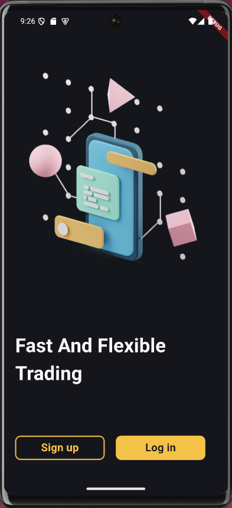
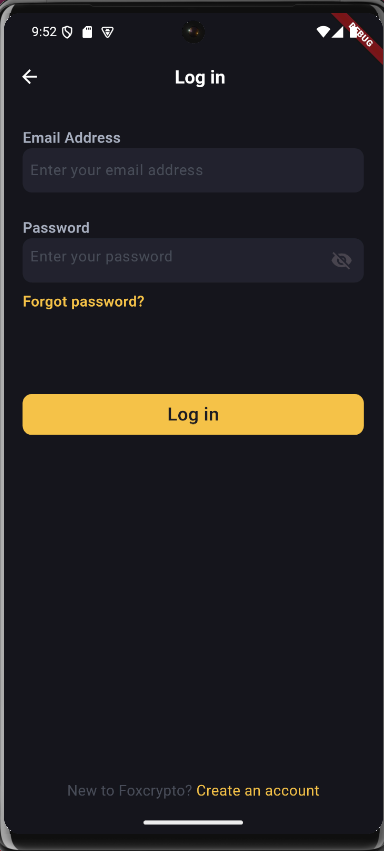
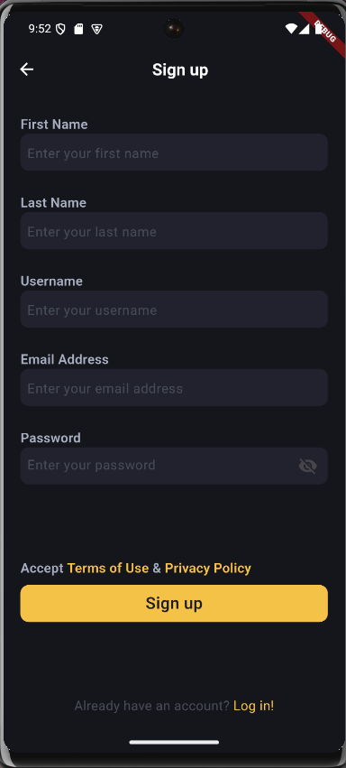
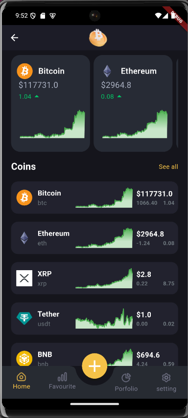
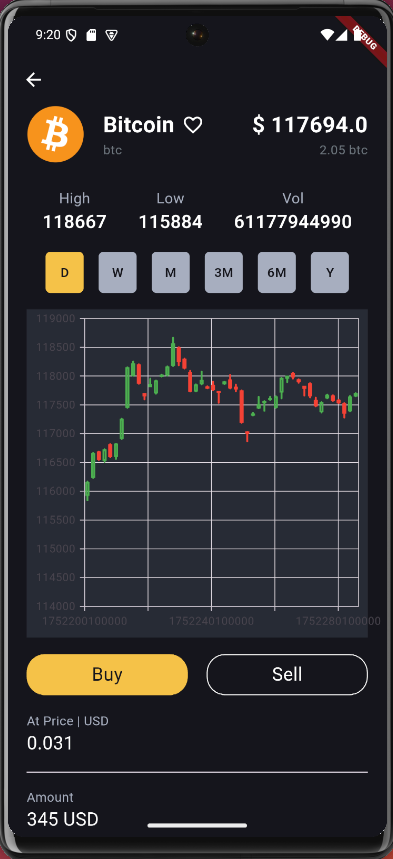

# 📱 CryptoApp - Flutter

**CryptoApp** là một dự án cá nhân do tôi tự thiết kế và phát triển hoàn toàn bằng Flutter/Dart.  
Ứng dụng giúp người dùng theo dõi dữ liệu tiền điện tử theo thời gian thực, bao gồm biểu đồ giá, thông tin chi tiết coin, cảnh báo giá và mô phỏng giao dịch mua bán.  
Dự án được xây dựng từ đầu để thể hiện kỹ năng thiết kế UI, quản lý trạng thái, gọi API và lưu trữ cục bộ.  
Ứng dụng sử dụng các kỹ thuật và thư viện hiện đại như `Cubit`, `Freezed`, và `Retrofit` để đảm bảo hiệu suất và tính ổn định cao.

---

## 📸 Giao Diện Demo

### 🔐 Onboarding, Login & Signup

| Onboarding | Login | Signup |
|------------|-------|--------|
|  |  |  |

### 🏠 Màn hình chính

| Home 1 | Home 2 |
|--------|--------|
|  |  |

### 💹 Màn hình chi tiết coin

<p align="center">
  
</p>

---

## 🚀 Tính Năng Nổi Bật

- 📈 Hiển thị biểu đồ biến động giá (line chart / candlestick)
- 🔍 Xem thông tin chi tiết từng đồng coin: giá cao nhất, thấp nhất, khối lượng,...
- ⏱ Chuyển đổi thời gian: ngày, tuần, tháng, năm
- 🌙 Giao diện tối (dark mode) hiện đại
- 📡 Cập nhật dữ liệu từ API thông qua Retrofit

---

## 🛠️ Công Nghệ & Thư Viện

- **Flutter** & Dart
- **Clean Architecture**
- **Cubit** (Bloc library): quản lý trạng thái mượt mà
- **Freezed**: tạo data model an toàn, dễ bảo trì
- **Retrofit** + `json_serializable`: kết nối API hiệu quả
- **Postman Mock API**: mô phỏng dữ liệu coin thực tế
- **fl_chart**, **candlesticks**: hiển thị biểu đồ trực quan
- **SharedPreferences**: lưu trữ dữ liệu cục bộ như trạng thái đăng nhập, cài đặt,...
- Responsive cho Android và iOS

---

## 🔧 Cài Đặt & Chạy Ứng Dụng

```bash
# Clone dự án
git clone git@github.com:phunghao2903/cryptoapp-flutter.git

# Cài đặt dependencies
cd cryptoapp-flutter
flutter pub get

# Chạy ứng dụng
flutter run

